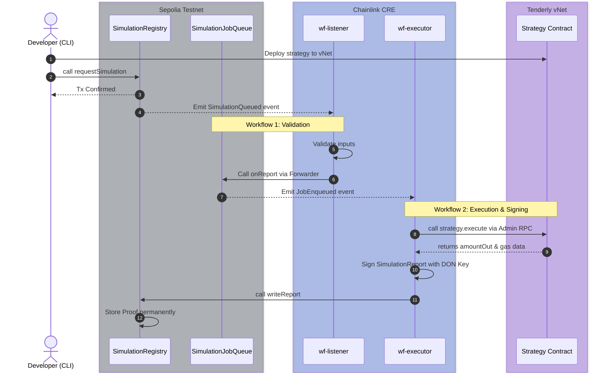
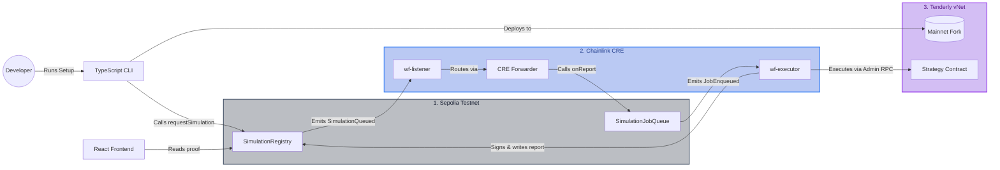
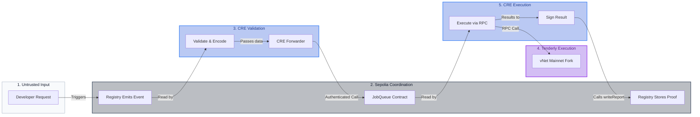

# DeFi Strategy Profiler

A developer tool for simulating DeFi strategies on a real Ethereum mainnet fork and getting **trustless, on-chain proof** of execution - signed by the Chainlink DON, stored permanently on Sepolia.

---

## Live Links

|                                 | Link                                                                                          |
| ------------------------------- | --------------------------------------------------------------------------------------------- |
| 🌐 Frontend                     | https://defi-strategy-profiler.vercel.app/                                                    |
| 🎬 Demo Video                   | https://youtu.be/F90Hq8e9ArA?si=ljiXZ2VMSBpUbdG1                                              |
| 🔍 Tenderly vNet Explorer       | https://dashboard.tenderly.co/explorer/vnet/58969812-bf1b-42b1-a51e-e6c42d453e83/transactions |
| 📄 SimulationRegistry (Sepolia) | https://sepolia.etherscan.io/address/0x6C60a2dEbD7a0406fB08133c44FC0bAeB2424e7d               |
| 📄 SimulationJobQueue (Sepolia) | https://sepolia.etherscan.io/address/0x9E3EA28542fD36B062ac768037fFb93708529Ad1               |

---

## The Problem

DeFi developers have no trustless way to prove a strategy works.
Logs can be faked. Scripts can be cherry-picked. Screenshots mean nothing.

**DeFi Strategy Profiler fixes this.**

---

## What It Does

DeFi developers write strategy contracts, but testing them realistically before mainnet is painful - local forks drift from real state, results are unverifiable, and gas estimates are inaccurate.

**DeFi Strategy Profiler** solves this by:

- Forking Ethereum mainnet with real liquidity and real prices via Tenderly Virtual TestNets
- Executing your strategy on that fork using Chainlink CRE workflows
- Writing a **DON-signed SimulationReport** back on-chain - proof that is trustless and permanent
- Displaying the full report (token flow, gas cost, exchange rate, revert reason) on a public frontend

---

## How It Works



```Developer
  └─▶  npm run cli:provision:0
          ├─ getOrCreateVnet()      creates Tenderly mainnet fork, syncs all configs
          ├─ deployStrategy()       deploys strategy contract to vNet
          └─ requestSimulation()    calls SimulationRegistry on Sepolia

SimulationRegistry (Sepolia)
  └─▶  emit SimulationQueued(runId, strategy, caller, explorerUrl)

wf-listener (Chainlink CRE)
  └─▶  logTrigger on SimulationQueued
          ├─ validates strategy address + explorerUrl
          ├─ encodes JobReport data
          └─ calls SimulationJobQueue.onReport()  via CRE Forwarder

SimulationJobQueue (Sepolia)
  └─▶  CRE Forwarder verified · replay protection · emit JobEnqueued(runId, strategy, caller)

wf-executor (Chainlink CRE)
  └─▶  logTrigger on JobEnqueued
          ├─ calls strategy.execute() on Tenderly vNet via Admin RPC
          ├─ captures amountOut · gasUsed · effectiveGasPrice
          ├─ signs SimulationReport with Chainlink DON key
          └─ calls SimulationRegistry.onReport(runId, signedReport)

SimulationRegistry (Sepolia)
  └─▶  Proof stored permanently · queryable by anyone · displayed at frontend /run/<runId>
```

---

## Repository Structure

```text
/
├── contracts/          Solidity contracts - Registry, JobQueue, strategies, interfaces
├── cre/                Chainlink CRE workflows - wf-listener, wf-executor, config
├── cli/                TypeScript CLI - setup, provision, deploy, report scripts
├── frontend/           React + Vite app - public report viewer at /run/[runId]
└── .env.example        Template - copy to .env and fill in values
```

Each directory has its own `README.md` covering setup, internals, and configuration.

---

## Architecture

High-level overview showing how the Tenderly fork, Chainlink CRE infrastructure, and Sepolia contracts interact.



### Three Environments

| Environment                  | Role                                  | Key Components                             |
| ---------------------------- | ------------------------------------- | ------------------------------------------ |
| **Sepolia Testnet**          | Coordination + permanent proof        | `SimulationRegistry`, `SimulationJobQueue` |
| **Chainlink CRE**            | Decentralized orchestration + signing | `wf-listener`, `wf-executor`               |
| **Tenderly Virtual TestNet** | Mainnet fork execution                | Strategy contract, Uniswap V3              |

> **Environment diagrams** in [`assets/`](./assets/) — Sepolia, CRE, Tenderly environments.

---

## Built With

| Layer                   | Technology                               |
| ----------------------- | ---------------------------------------- |
| Smart Contracts         | Solidity 0.8.24 - Foundry - OpenZeppelin |
| Decentralized Execution | Chainlink Runtime Environment (CRE)      |
| Mainnet Fork            | Tenderly Virtual TestNets                |
| On-chain Attestation    | Chainlink CRE Forwarder                  |
| CLI                     | TypeScript - tsx - viem                  |
| Frontend                | React 19 - Vite - viem - Tailwind CSS    |
| Network                 | Sepolia Testnet                          |

---

## Deployed Contracts (Sepolia)

| Contract             | Address                                                                                                                         |
| -------------------- | ------------------------------------------------------------------------------------------------------------------------------- |
| `SimulationRegistry` | [`0x6C60a2dEbD7a0406fB08133c44FC0bAeB2424e7d`](https://sepolia.etherscan.io/address/0x6C60a2dEbD7a0406fB08133c44FC0bAeB2424e7d) |
| `SimulationJobQueue` | [`0x9E3EA28542fD36B062ac768037fFb93708529Ad1`](https://sepolia.etherscan.io/address/0x9E3EA28542fD36B062ac768037fFb93708529Ad1) |

These are shared - anyone can use them. If you want your own isolated deployment, see [`contracts/README.md`](./contracts/README.md).

---

## Pre-Defined Strategies

Three example strategies are included out of the box:

| Index | Contract                       | Description                                         |
| ----- | ------------------------------ | --------------------------------------------------- |
| `0`   | `EthToUsdcSwapStrategy`        | Single-hop WETH to USDC swap via Uniswap V3         |
| `1`   | `EthToUsdcDaiMultiHopStrategy` | Multi-hop WETH to DAI to USDC swap                  |
| `2`   | `FailingSlippageStrategy`      | Intentionally reverts - demonstrates revert capture |

---

## Quickstart

### Prerequisites

- Node.js 18+
- Foundry - `curl -L https://foundry.paradigm.xyz | bash`
- Chainlink CRE CLI - [install guide](https://docs.chain.link/cre)
- Tenderly account with API access

### 1. Clone and install

```bash
git clone https://github.com/0xEunum/defi-strategy-profiler
cd defi-strategy-profiler
npm install
```

### 2. Configure environment

```bash
cp .env.example .env
cp contracts/.env.example contracts/.env
```

**Root `.env`** — open `.env` and fill in:

```bash
CRE_ETH_PRIVATE_KEY=        # Your Sepolia wallet private key (no 0x prefix)
TENDERLY_ACCESS_KEY=         # Tenderly dashboard -> Settings -> Authorization
TENDERLY_ACCOUNT_SLUG=       # Your Tenderly account slug
TENDERLY_PROJECT_SLUG=       # Your Tenderly project slug
```

**Contracts `.env`** — open `contracts/.env` and fill in:

```bash
ALCHEMY_KEY=                 # Alchemy API key — used by Foundry RPC endpoints
ETHERSCAN_API_KEY=           # Etherscan API key — used by forge verify
```

> `VNET_ADMIN_RPC_URL` is **auto-filled** by `npm run cli:setup`. Do not set it manually. All other variables are pre-defined.

### 3. Setup

```bash
npm run cli:setup
```

This creates a Tenderly Virtual TestNet forked from Ethereum mainnet, funds both vNet accounts with ETH, and syncs `VNET_ADMIN_RPC_URL` in `.env`, `executorAddress` in `cre/config.staging.json`, and the vNet public RPC in `cre/project.yaml` - all automatically.

> For full details see [`cli/README.md`](./cli/README.md)

### 4. Provision and simulate

```bash
# Run once per strategy - deploys contract + emits SimulationQueued on Sepolia
npm run cli:provision:0    # EthToUsdcSwapStrategy
npm run cli:provision:1    # EthToUsdcDaiMultiHopStrategy
npm run cli:provision:2    # FailingSlippageStrategy
```

> For full details see [`cli/README.md`](./cli/README.md)

### 5. Start CRE workflows

```bash
# Terminal 1
npm run cre:listener

# Terminal 2
npm run cre:executor
```

Once CRE completes, the simulation report prints in the terminal (if `POLL_FOR_RESULT=true` in `.env`) and is available on the frontend.

> For full details see [`cre/README.md`](./cre/README.md)

---

## Why Two CRE Workflows?



`SimulationQueued` is emitted by raw user input - anyone can call `requestSimulation()` with a malicious strategy address. `wf-executor` must never act on untrusted input directly.

`wf-listener` sits between them: it validates the job, encodes a `JobReport`, and writes it to `SimulationJobQueue` **via the CRE Forwarder**. Only the Chainlink DON can write to `SimulationJobQueue` - not users. When `JobEnqueued` fires, `wf-executor` knows it is CRE-attested and safe to execute.

`SimulationJobQueue` also enforces `s_jobExists[runId]` - a duplicate enqueue from a `wf-listener` retry is silently rejected.

See [`cre/README.md`](./cre/README.md) for the full workflow breakdown.

---

## CLI Commands

```bash
npm run cli:setup            # Create vNet + auto-sync all configs
npm run cli:setup:new        # Force a fresh mainnet fork

npm run cli:provision:0      # Deploy + simulate EthToUsdcSwapStrategy
npm run cli:provision:1      # Deploy + simulate EthToUsdcDaiMultiHopStrategy
npm run cli:provision:2      # Deploy + simulate FailingSlippageStrategy

npm run cre:listener         # Start wf-listener (Terminal 1)
npm run cre:executor         # Start wf-executor (Terminal 2)

npm run contracts:test       # Run Foundry tests
npm run frontend:dev         # Start React frontend
```

See [`cli/README.md`](./cli/README.md) for the full script reference.

---

## Frontend

The React + Vite frontend at `/run/[runId]` displays:

- Strategy name and address
- Token flow — amount in, amount out, effective exchange rate
- Gas used, gas price, total ETH cost
- Simulation status — Success or Reverted (with revert reason hash)
- Tenderly vNet explorer link for full transaction trace

**Live:** https://defi-strategy-profiler.vercel.app/

See [`frontend/README.md`](./frontend/README.md) for local setup and deployment.

---

## Implementing Your Own Strategy

```solidity
// SPDX-License-Identifier: MIT
pragma solidity ^0.8.24;

import {IDeFiStrategy} from "./interfaces/IDeFiStrategy.sol";

contract MyStrategy is IDeFiStrategy {
    address public constant TOKEN_IN  = 0xC02aaA39b223FE8D0A0e5C4F27eAD9083C756Cc2; // WETH
    address public constant TOKEN_OUT = 0xA0b86991c6218b36c1d19D4a2e9Eb0cE3606eB48; // USDC

    /// @notice Execute the strategy with msg.value as ETH input.
    /// @param receiver  Address that receives TOKEN_OUT at the end.
    /// @param params    ABI-encoded extra params (minAmountOut, path flags, etc.)
    /// @return amountOut Actual TOKEN_OUT received.
    function execute(
        address receiver,
        bytes calldata params
    ) external payable returns (uint256 amountOut) {
        // your swap / DeFi logic here
    }
}
```

Deploy to the vNet, then request a simulation:

```bash
cast send $REGISTRY_ADDRESS \
  "requestSimulation(address,string)" \
  <yourStrategyAddr> <explorerUrl> \
  --rpc-url $SEPOLIA_RPC_URL \
  --private-key $CRE_ETH_PRIVATE_KEY
```

See [`contracts/README.md`](./contracts/README.md) for the full `IDeFiStrategy` interface and deployment guide.

---

## Documentation

Each directory has a dedicated README covering setup, internals, and configuration:

| Directory    | README                                         | Covers                                                                                        |
| ------------ | ---------------------------------------------- | --------------------------------------------------------------------------------------------- |
| `contracts/` | [`contracts/README.md`](./contracts/README.md) | Solidity contracts, IDeFiStrategy interface, pre-defined strategies, tests, custom deployment |
| `cre/`       | [`cre/README.md`](./cre/README.md)             | wf-listener, wf-executor, two-workflow design, config files                                   |
| `cli/`       | [`cli/README.md`](./cli/README.md)             | Setup, provision, deploy commands, state files, report output                                 |
| `frontend/`  | [`frontend/README.md`](./frontend/README.md)   | React.js app, local setup, deployment                                                         |

---

## What's Next

- **Multi-chain support** - Arbitrum, Base, Optimism, Polygon mainnet forks
- **Cross-chain simulation** - bridge strategies via Chainlink CCIP
- **Custom strategy builder** - upload ABI + constructor args from frontend, no CLI needed
- **Multi-strategy batch runs** - run all strategies in one command, compare side by side
- **Historical fork selection** - simulate at any past block number
- **Gas optimization reports** - per-opcode breakdown via Tenderly simulation traces
- **Strategy leaderboard** - public ranking of most gas-efficient strategies by category

---

## License

MIT (c) [LICENSE](./LICENSE)
